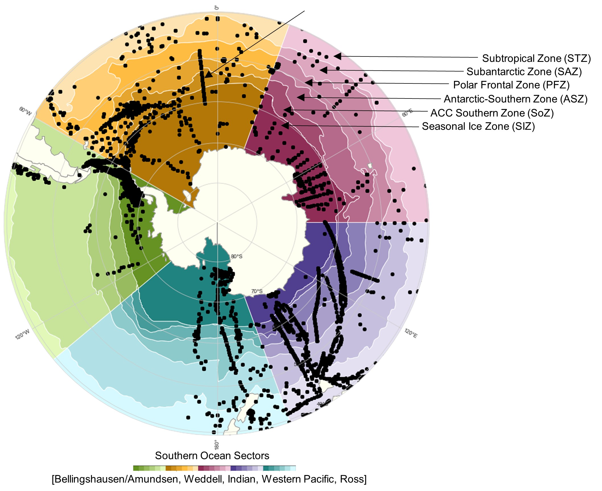
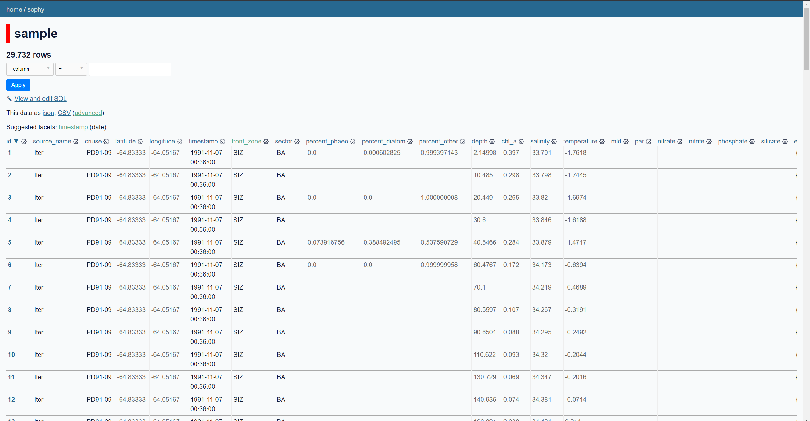

# SOPHY: Southern Ocean Phytoplankton Database
- UW Oceanography
- Made by Ayush Nag and Hannah Joy-Warren

In situ observations combined with phytoplankton taxonomies, ocean fronts, and ocean sectors
- Built with SQLite and Python
- Helper functions to make accessing data easy
- Visualizations to see data over time, regions, and biological parameters

<p align="center">
  
</p>


# Environment and package setup
Create new environment
- [Miniconda](https://docs.conda.io/en/latest/miniconda.html) is recommended

To explore the data in table form through a web browser ([Datasette](https://datasette.io/))
1) ```conda create -n sophyvenv datasette pandas jupyter tqdm```
2) ```conda activate sophyvenv```
3) ```datasette sophy.db -o```


<p align="center">
  
</p>

To visualize the data using a Jupyter Notebook
1) ```conda create -n sophyvenv geopandas cartopy jupyter seaborn tqdm```
2) ```conda activate sophyvenv```
3) Plotting and query functions available in [sophy.ipynb](sophy/sophy.ipynb)
