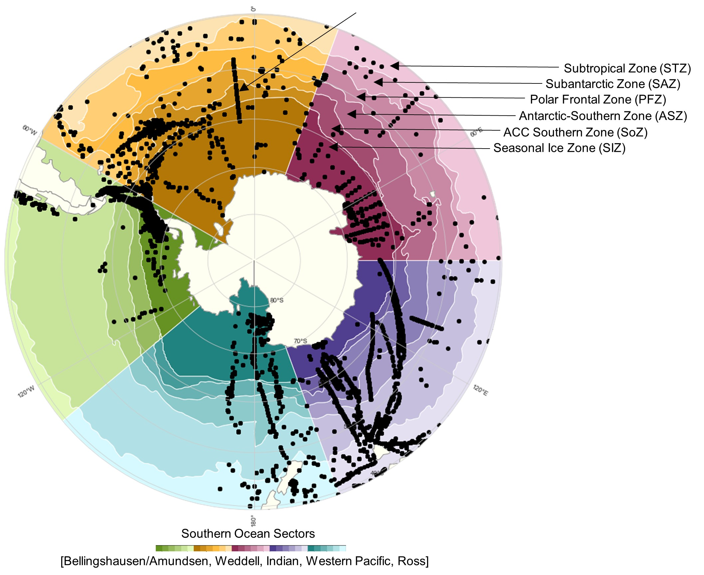
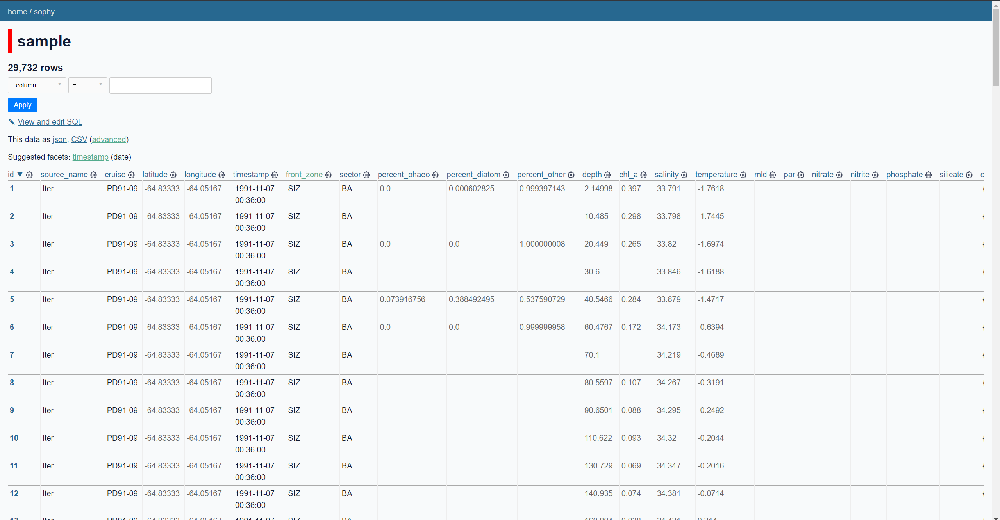
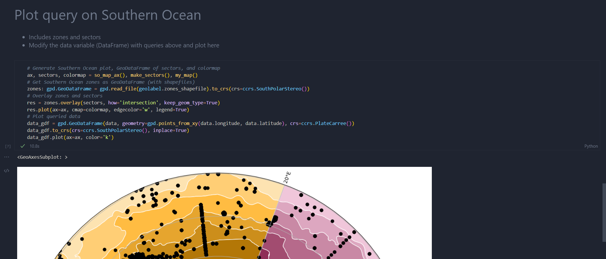

# SOPHY: Southern Ocean Phytoplankton Database
[](https://github.com/ayushnag/sophy/blob/main/LICENSE)
- UW Oceanography
- Made by Ayush Nag and Hannah Joy-Warren

In situ observations combined with phytoplankton taxonomies, ocean fronts, and ocean sectors
- Built with SQLite and Python
- Helper functions to make accessing data easy
- Visualizations to see data over time, regions, and biological parameters
- Data: [sophy.xlsx](sophy.xlsx)

<p align="center">
  
</p>


# Environment and package setup
Create new environment
- [Miniconda](https://docs.conda.io/en/latest/miniconda.html) is recommended

To explore the data in table form through a web browser using [Datasette](https://datasette.io/)
1) ```conda create -n sophyvenv datasette pandas jupyter tqdm```
2) ```conda activate sophyvenv```
3) Run the cell for Option 1 in [sophy.ipynb](examples/sophy_example.ipynb) to build sophy.db
4) ```datasette sophy.db -o```


<p align="center">
  
</p>

To visualize the data using a Jupyter Notebook
1) ```conda create -n sophyvenv geopandas cartopy jupyter seaborn tqdm```
2) ```conda activate sophyvenv```
3) Follow the steps in [sophy.ipynb](examples/sophy_example.ipynb) for sample queries and plotting

<p align="center">
  
</p>

# Data Sources
- Palmer Station Antartica LTER (lter)
  - Palmer Station Antarctica LTER and N. Waite. 2022. Merged discrete water-column data from annual PAL LTER field seasons at Palmer Station, Antarctica, from 1991 to 2021. ver 1. Environmental Data Initiative. https://doi.org/10.6073/pasta/7358be99bd7ec1c73293893defb289d3 (Accessed 2023-02-13).
- Phytobase (phytobase)
  - Righetti, D., Vogt, M., Zimmermann, N. E., Guiry, M. D., and Gruber, N.: PhytoBase: A global synthesis of open-ocean phytoplankton occurrences, Earth Syst. Sci. Data, 12, 907–933, https://doi.org/10.5194/essd-12-907-2020, 2020.
- AMT Cruises (AMT)
  - Rees, A., Robinson, C., Smyth, T., Aiken, J., Nightingale, P., & Zubkov, M. (2015). 20 years of the Atlantic Meridional Transect-AMT. Limnology and Oceanography Bulletin, 24(4), 101-107.
  - https://doi.org/10.1002/lob.10069
  - https://www.amt-uk.org/
  
Note: This database modifies the original datasets and is NOT a replacement for the original datasets.
