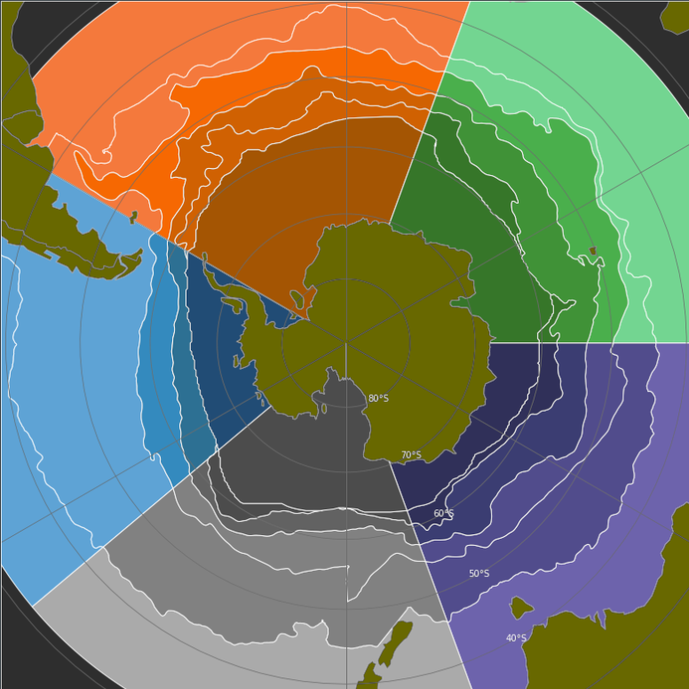
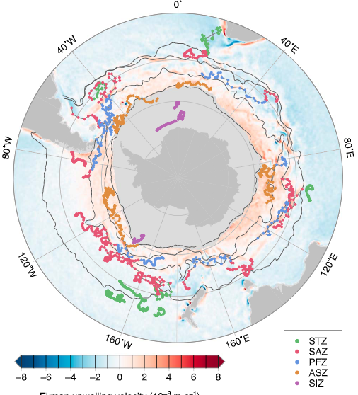
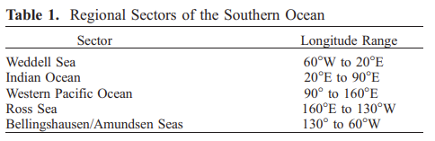
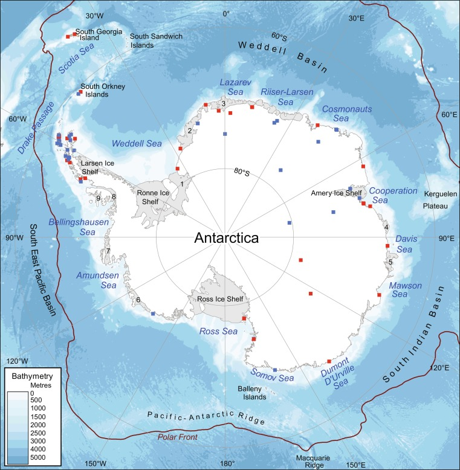

# SOPHY Notes - Ayush Nag

### Fall 2022 goals
SOPhy database
- Continue adding datasets from papers
  - Add phytoplankton groups feature and modify schema to accommodate variety of data
- Make frontend for visualizations and data use
  - GitHub pages, Jupyter Notebook, or Python to visualization packages
- Publish database
  - Hosted on GitHub or Zenodo repository
  - Publish paper

### LTER ML model focus idea
- The LTER dataset is the golden standard in terms of format and amount of data (30,000 data points over 30 years)
- The rest of the datasets will contain ~150 data points total and seem insufficient to train the niche model
- Idea: Make the niche model a proof of concept using only the LTER dataset
  - Continue with original plan of clustering using BGC-ARGO floats
  - Then instead of training niche model on the entire dataset just use LTER
  - If successful, we will have a proof of concept for the core idea
  - Once NASA PACE is online we will have significantly more data and can apply the same techniques to all available data

### Data format challenge
- I have started working through the datasets that can be entered in the database
- The issue is that their formats are significantly different
  - Some contain ratios of values where we expect a quantity
  - Some contain a mix of CHEMTAX and microscopy in one row
  - Some average values over a certain region and don't publish the individual points, so we cannot use it
  - In general, many essential fields are missing (lat, depth) that need to be tracked down
- We will have to come up with a new approach to entering data, since there are oceanography decisions to be made when entering data where I don't have experience.

### NSIDC Sea Ice Extent data challenge
- TODO: finish section
- [Include images of the grid from NSIDC]
- Isolated boundary but the points were out of order. Solution to that problem

### Summer 2022 second half goals
- Main goal is to enter data and make visualization/front end for the database
- Features still pending are metadata information when entering datasets and ways to visualize the different types of data
- Latest task completed was separating data into two different categories. Presence vs data with biological and chemical data present. Essentially a table that has our ideal datasets like LTER with HPLC + chlorophyll, etc. Then another table for datasets that have lat, lon, time, and species present only. Phytobase and OBIS have lots of data like that. All the data will still be there, it will just avoid having tons of data with no entry for our biological columns. It can also make grouping the data easier since we can just ignore the Phytobase type data when we are doing clustering later on.
- Current software progress:
<p align="center">
  
</p>

- All fronts/boundaries and their respective zones are shapefiles. Data is easily labelled with a spatial join to this GeoDataFrame

### GeoLabel class
- Wrote hundreds of test lines over 2 weeks to get shapefiles and geopandas working
- Refactored several times to simplify the functions as much as possible. Zones are labeled with a simple geospatial join
```python
import geopandas as gpd
zones_gdf = gpd.read_file(GeoLabel.zones_shapefile)
result = gpd.sjoin(data_gdf, zones_gdf)
```

### Modifications to Kim and Orsi's front data
- Removed small extra dots included in the fronts
- Old versions have SBdy from Kim and Orsi. There is a large gap in the SBdy that is closed with a straight line by Shapely
- Data includes points from lat [-180, 360] but [-180, 180] is duplicate of [0, 360]; we kept [-180, 180]

### Unsupervised learning to define Southern Ocean sectors
- The niche model will not use the traditional front definitions to group data
- Instead, we will use temp + salinity + other bio factors to make custom clusters with unsupervised machine learning
- Based off the work in [this](https://doi.org/10.1029/2018JC014629) paper by Dan Jones in 2019
- Fronts are difficult to define as a fixed boundary which is why a more open clustering system seems more representitive

### RG Climatology to Southern Ocean Fronts
- I have access to code that converts [RG Climatology data](http://sio-argo.ucsd.edu/RG_Climatology.html) from Argo sensors into ocean front polygons
- The two options are:
1) Rewrite all the code
   - Code is well documented but not efficient and contains lots of extra steps, hardcoded values, and not very modular
   - Meet with author and document every step/calculation. Then replicate process but with my own code
   - Pros:
     - High quality code. Easy to read, modify, and debug
   - Cons:
     - Time (at least a week). I need to understand the program, new datastructures, new packages etc.
     - If there are updates to the original code, I will not receive them (no longer a fork)
2) Make small updates to code
   - Fix hard coding
   - Pros:
     - Code is already written and verified 
     - Saves me a lot of time
   - Cons:
     - Leaves overall codebase vulnerable to bugs in that portion of code
  - My current choice is option 2. The core of this project is to make the most useful database possible, so I think my time is better spent building other features. I will still make updates to the code to avoid hardcoding and small performance issues as they come up. Now I can focus on tasks building around this code. Some examples include:
    - Automatic data retrieval. Simply call a function or script and the database will download new climatology data, calculate the fronts, and update the database.
    - NetCDF export/import. Add feature to export fronts as a NetCDF file, so it can be used for other research. In the future, if there are new ways of calculating fronts we can import the NetCDF from that calculation and keep the rest of the code the same.

### Spatial Data Workflow
- How will data flow from raw input data to queryable results at the front end?
- Geo data is different because points inside a shape are not directly stored (only the edges are)
- This section describes the different technologies that can be used and how they will interact

#### GeoPandas and GeoJSON
- GeoJSON is an open-source format for encoding a variety of geographic data structures such as Lines, Polygons, Inner/Outer Rings, etc
- Similar to the popular ESRI shape file, but it's open source. It can also be easily modified and created with python/shapely
- GeoPandas allows for geospatial queries with GeoJSON's and DataFrames
- For example PIP calculations can be done with a geospatial join using .contains(), .within(), .join(), etc.
- GeoPandas also allows for indexing GeoJSON's for speeding up queries. [This example](https://geoffboeing.com/2016/10/r-tree-spatial-index-python/) shows R-Tree Spatial Indexing in GeoPandas
#### SpatiaLite?
-  Open-source extension to SQLite that allows for spatial data (like GeoJSON shapes) to be stored and queried from
- Has all the functionality of sqlite, so it doesn't narrow the usability of the database
- This will only be used if we decide to keep shape files in the database for query use. Otherwise just labeling data serves the same purpose of having geospatial queries
#### Point Inside Polygon (PIP)
- Large amounts of data will need to be processed with PIP
- All data entries will be labeled with a zone (STZ, SAZ, etc.) and sector which could be expensive
- An alternative is to store the shapes and calculate PIP at runtime
  - However, this is a runtime cost whereas I am trying to optimize for insert time costs
  - This also adds complexity for the users since they need to understand what a polygon/shapefile is and how to use them in queries

### Southern Ocean Fronts and Sectors
#### Fronts
- "Boundary between two distinct water masses"
- Dividing line where ocean is physically different
- Change over time but data uses composite data to pick one line for a span of time (e.g. 1 year)
- Get raw data as series of points over time. Convert that to shape file (GeoJSON?). Load into python and geopandas
- Then users can add new front data if they want by simply replacing the file and calling an update on the database
<p align="center">
  
</p>

#### Sectors
- Fixed sectors of the sea commonly used
- Arbitrarily defined so people have other definitions they use
- Similar to fronts, define a shape file and allow users to upload one of their own
<p align="center">
  
</p>


### Data Science Notebook Options
#### Jupyter
- Runs locally so no internet connection needed after download
- Dataset has to be stored on local machine
#### Google Colab
- Ease of use to share and use
- Backend performance of Google servers
  - Particularly important for ML models which actually need extra power
- Modules are pre-installed
- Easy versioning with Google and GitHub integration
#### Deepnote
- Designed for collaboration. Multiple people can live edit a notebook
- Many code "intelligence" features like auto install packages and autocomplete

Current pick is to create Jupyter file and work in Intellij. Then if storage/performance becomes an issue, we can easily port the document into Google Colab. UW provides Google Drive storage which could be an option to store the database and then connect to Colab. If the database is stored on GitHub (regular Jupyter Notebook), file size may become an issue.


### Summer 2022 Goals
- Add more data to SOPHY
  - Start with LTER and Phytobase. LTER is the most ideal format to test and Phytobase has by far the most microscopy data
- Define regions and tags for data
  - Use GeoJSON/GeoPandas to label data
  - Brainstorm all the regions that are needed (oceans, fronts, etc.)
- Create Jupyter notebook or Google Colab front end
  - Custom python functions for common oceanography use cases of this data
  - Direct SQLite editor for advanced users
  - Map visualization of all data
  - UW Research Computing Club has access to Azure, AWS, etc. servers for ML 
- Start niche model/ML/Objective 3
  - An idea is to start with unsupervised learning and then switching to supervised. Lets the ML project get started and potentially find trends we were not expecting.
  - Could use synthetic data while real data is not there 

### Feature Ideas
- Think about how this could be adapted to the future of phytoplankton data
  - For example if Argo floats may start having taxa data
  - Or just any sensor based data that includes taxa because our current model is just for _in situ_ observations
- What are side 'features/products' that can be made for SOPHY and general use
  - Adapter class that provides starter code for converting dataset into SQLite

### Spring Quarter 2022 Wrap-Up
- Feature List:
  - Main script can add two full data to database (~1.3 mil rows)
    - _LTER_ and _Phytobase_ were chosen since they cover the two different formats of taxonomy data (microscopy and CHEMTAX)
    - Also adds foreign keys from microscopy table (Phytobase)
  - Query WoRMS database for taxa records
    - Converts result from pyworms package into formatted dataframe
  - **Modular code** that easily translates to other data
    - Code from this quarter is quite short since I have reviewed each operation several times to prioritize simplicity and performance as a setup for the summer
    - The formula is made for how to add new data; data read, modify, write, and fk setup
- Next steps:
  - Support for location, source, and tag tables as part of data insert
  - Work on test suite even though code format may change (new classes/functions)
  - Build collection of data we want to add to SOPHY
    - Can be done concurrently with writing new code
    - The schema and code will adapt to deal with new challenges or design changes
  - How to interact with the database?
    - Research how scientific databases are usually presented (GUI, Jupyter, etc.)
    - We can make pre-built use cases for common operations

### Iterating over a Dataframe
- I was finding methods to iterate over a dataframe such as itterows(), but operations seemed to be taking longer than expected (~2s)
- Across several functions, I was incorrectly iterating over a dataframe rather than **vectorization** and using pandas built in indexing
- **Vectorization** means using pre-defined, highly optimized methods to process data
- The time complexity and runtime is orders of magnitude lower when using vectorization since DataFrame's are meant to use it

### Natural Key vs AphiaID
- Datasets that contain microscopy data will most likely contain a 'scientific_name' field that we will also have a corresponding AphiaID we will get from the WoRMS database
- sci_name is a key for aphia_id and vice versa, so we should only store one of them in the main table
- However not all microscopy data goes to the level of sci_name and may only go down to genus
- In that case the aphia_id approach is correct since we can keep the aphia_id for the genus and then have access to it's full taxa through the microscopy table whereas that would not be possible with only a sci_name col in the main table
- This approach also correctly handles the issue of when two names are different in Python or just visually, but actually represent the same species (WoRMS flags species name as unaccepted)
```python
import pyworms
pyworms.aphiaRecordsByMatchNames('Coccopterum labyrinthus')  # accepted name
pyworms.aphiaRecordsByMatchNames('Coccopterum_labyrinthus')  # slightly different formatting
pyworms.aphiaRecordsByMatchNames('Pterosperma labyrinthus')  # unaccepted name, but same species
```
- A rank column may also be useful however it seems like data that can be inferred from what data is present and not present, so TBD

### Defining geospatial regions in the Southern Ocean
- We want to be able to label rows with a certain regions like the one seen in the map:
<p align="center">
  
</p>- Cannot use simple lat long filters since they are rectangular unlike our regions
- Solutions inlcude ArcGIS filter/map or polygons that have predefined these regions
- Main point is that there must be a mapping from latitude to region
- If one is not available, we can explore how to create that mapping
- Mapping can and should be done at insert time, not runtime to speed up queries that use this data
- Some options are GeoPandas, [GeoJSON](https://handsondataviz.org/geojsonio.html), ArcGIS, PostGIS, pyshp, PyGIS, and arcpy
- An issue with the Arc family is that they are not open-source unlike GeoJSON and others
- 

### Workflow of Python and SQLite
- Both have a way of storing large amounts of 2D data(dataframes vs. tables) so it can be confusing when to use which
- Dataframes are much easier to modify, can be used alongside python code, and keeps history of operation
- SQLite is [much faster](https://www.thedataincubator.com/blog/2018/05/23/sqlite-vs-pandas-performance-benchmarks/) at select style operations
- Data loading, cleanup, and write to database will be done in Python with dataframes 
- Then queries only with SQLite

### Re-normalization of columns: major fix
- Updated schema to avoid normalizing much more than needed (3 FK's in schema)
- I used to create a whole new cruise table since I thought repeating a string in the same column was repeated data that needed to be fixed
- **Normalization means when one column can allow you to infer other columns**
  - For example when knowing the source name (LTER) can tell you author, doi, url, etc. and that data doesn't need to be repeated across many columns
  - One **key** gives you access to the other columns
  - Then that data goes in a new table and the main table simply references that one key to have access to the rest of the data
  - It's ok to repeat values within a column, but there shouldn’t be columns that infer other columns within a table
- This change has drastically reduced the number of tables in the DB (see schema v5 &rarr; v6)

### Primary Key Setup
- They can be auto-generated in SQLite, but is that the best way?
```sql
id int primary key autoincrement
```
- Some alternatives are GUID, UUID, and natural keys
- The key does not need to be unique across the database so GUID is probably overkill
- Autoincrement is the best option for now since it also the default option in SQLite

### Tech Stack
- Dataset(CSV) &rarr; DataFrame(Python) &rarr; sophy(SQLite)
- Sophy can be created in sqlite (createTables.sql) then saved as an .db file to insert data with Python
- First test is to load the LTER dataset through the tech stack

### Column that can hold id of two possible tables
- The problem is called Polymorphic Associations
- I would like to reference two tables to the same column with an FK
  - For example microscopy id OR taxa id
- One fix is to make a supertable that generates a primary key, then the two 'sub' tables reference their id from the super table
- This is essentially a PFK (primary foreign key) since each row in the sub tables is unique but technically still a foreign key
- The only issue is that it complicates the schema and doing queries since there is an extra table needed to do inserts

### Phytoplankton microscopy vs. pigment based taxa classification
- I originally thought  each (in situ) dataset would provide a species name that could be converted into a taxonomy tree (using microscopy)
- In reality they provide either microscopy OR pigment data. Both provide a classification of the taxonomy of each sample
- Pigments are the chemical method by using pigment markers and the CHEMTAX software to determine the species composition of a water sample. CHEMTAX gives the percentage of ~5 groups to determine species comp.
- The schema needs to be restructured to reflect this change. One row in one dataset represents a full water sample(pigments) but one row in another dataset represents the amount of each species found (microscopy). Since they are inherently different row structures, a new table may be needed.

### Tags
- We need to be able to classify rows with certain data like the method of sampling, quality of data, etc
- Tags are a great way to do this since we can create a tag, then reuse that same tag for several rows
- Represented by a many &rarr; many relationship in SQL.

### WoRMS Database
- We will be using [WoRMS](https://www.marinespecies.org/) since it is the most relevant and established database for our research
- All taxonomy data will be sourced from there
- There is Python package that allows us to query the DB and get the full taxa of a species
```python
import pyworms
pyworms.aphiaRecordsByMatchNames('Carteria marina')
```

### Database Planning ###
- Who are the users?
  - Researchers (oceanography most likely)
  - They have experience with Python and Jupyter notebooks
  - Should make a document on how to use the program
- RDMS vs. Excel/CSV
  - CSV will get slow in the range of millions of columns to even just search
  - Major benefits will be seen when making the niche model
    - Researchers may not have super complex queries but the niche model will
    - The model will be **significantly** faster at runtime (visualization)
  - Data is also much easier to add since structure is clearly defined


